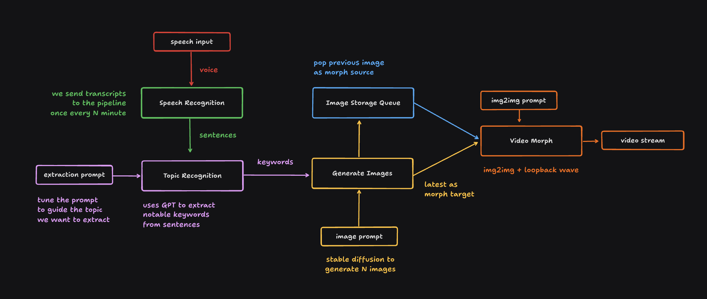

# Stable Diffusion From Speech

This program generates a continuously morphing dynamic wallpaper from real-time speech input.

It takes live speech input from your microphone, runs it through speech recognition,
passes it through a LLM to summarize and transform into image prompts, then gradually morphs the image into the subject being discussed on. The result would be a continuously-morphing videos reflecting the topics being discussed about.

## Code Structure

- `ui/`: frontend, written in React and Vite.
- `api/`: backend, written in fastapi and Python for inference.

## Architecture

